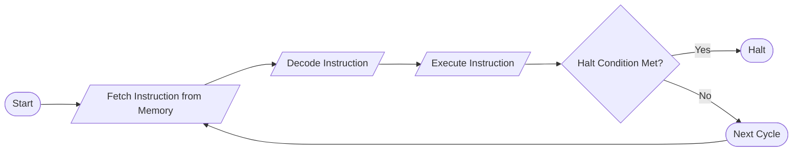

# CPU Architecture

```mermaid
flowchart LR
    Start([Start])
    FetchInstruction[/Fetch Instruction from Memory/]
    DecodeInstruction[/Decode Instruction/]
    ExecuteInstruction[/Execute Instruction/]
    CheckHaltCondition{Halt Condition Met?}
    Halt([Halt])
    NextCycle([Next Cycle])

    Start --> FetchInstruction
    FetchInstruction --> DecodeInstruction
    DecodeInstruction --> ExecuteInstruction
    ExecuteInstruction --> CheckHaltCondition

    CheckHaltCondition -- Yes --> Halt
    CheckHaltCondition -- No --> NextCycle
    NextCycle --> FetchInstruction
```
