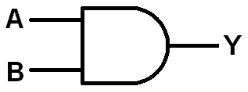
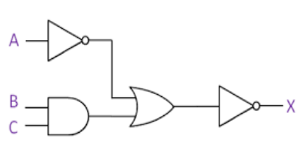
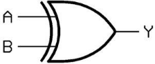

**Fundamentals of Computing for Healthcare Medical Technology Year 1** 

**Class Test** 

**Monday 24th April 2023** 

**Instructions:** 

**Answer All questions** 

**Question 1  (20 Marks)** 

1) Complete the truth table for the following logic diagram:  **(2 Marks)** 

| **A** | **B** | **Y** |
|-------|-------|-------|
|       |       |       |
|       |       |       |
|       |       |       |
|       |       |       |
2) Complete the truth table for the following logic diagram:  **(12 Marks)** 

**D **

**F E** 

| **A** | **B** | **C** | **D** | **E** | **F** | **X** |
|-------|-------|-------|-------|-------|-------|-------|
| **1** |       |       |       |       |       |       |
| **1** |       |       |       |       |       |       |
| **1** |       |       |       |       |       |       |
| **1** |       |       |       |       |       |       |
| **0** |       |       |       |       |       |       |
| **0** |       |       |       |       |       |       |
| **0** |       |       |       |       |       |       |
| **0** |       |       |       |       |       |       |
3) Complete the truth table for the following logic diagram:  (6 Marks)  

The above gate is a XOR gate.

The formula for a XOR gate is:

$Y = A \oplus B$  
or  
$Y = A \neq B$

| **A** | **B** | **Y** |
|-------|-------|-------|
| 0     | 0     | 0     |
| 0     | 1     | 1     |
| 1     | 0     | 1     |
| 1     | 1     | 0     |
|       |       |       |

**Question 2  (20 Marks)** 

1) How many bits in a MB?  (2 Marks)  
2) Explain the difference between primary storage (memory) and secondary storage on a computer and give two examples of each.    (10 Marks) 
3) Describe the components of the CPU  (8 Marks) 

**Question 3  (20 Marks)** 

1) What is the largest number you can store in 1 byte?  (2 Marks)  
1) Describe how text, integers and floating point numbers are stored in a computer. ( 12 Marks)  
1) Describe how a colour photograph might be stored on a computer.   (6 Marks) 

**Question 4  (20 Marks)** 

(a)  Convert the following numbers to the base specified. You must show your workings:  

| **From Base** | **Number** | **To Base** |
|---------------|------------|-------------|
| Binary        | 11110001   | Octal       |
| Octal         | 5701       | Decimal     |
| Hex           | CF01       | Binary      |
| Decimal       | 1587       | Hex         |

