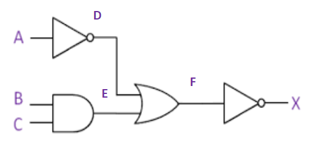

# Class Test 2023

Complete the truth table for the following logic diagram.

| A | B | C | D | E | F | X |
|---|---|---|---|---|---|---|
|   |   |   |   |   |   |   |

---

Answer:

D is the output of a NOT gate with input A.

$\therefore D = \overline{A}$

E is the output of a AND gate with inputs B and C.

$\therefore E = B \cdot C$

F is the output of a OR gate with inputs D and E.

$\therefore F = D + E$

X is the output of a NOT gate with input F.

$\therefore X = \overline{F}$

| A | $D=\overline{A}$ |
|---|-----------------:|
| 0 |                1 |
| 1 |                0 |

---

| B | C | $E=B \cdot C$ |
|---|---|--------------:|
| 0 | 0 |             0 |
| 0 | 1 |             0 |
| 1 | 0 |             0 |
| 1 | 1 |             1 |

---

| D | E | $F=D+E$ |
|---|---|--------:|
| 0 | 0 |       0 |
| 0 | 1 |       1 |
| 1 | 0 |       1 |
| 1 | 1 |       1 |

---

| F | $X=\overline{F}$ |
|---|-----------------:|
| 0 |                1 |
| 1 |                0 |

Putting all the values in the table:

| A | B | C | $\overline{A} = D$ | $B \cdot C = \bold{E}$ | $D+E=\bold{F}$ | $X=\overline{F}$ |
|---|---|---|-------------------:|-----------------------:|---------------:|-----------------:|
| 0 | 0 | 0 |                  1 |                      0 |              1 |                0 |
| 0 | 0 | 1 |                  1 |                      0 |              1 |                0 |
| 0 | 1 | 0 |                  1 |                      0 |              1 |                0 |
| 0 | 1 | 1 |                  1 |                      1 |              1 |                0 |
| 1 | 0 | 0 |                  0 |                      0 |              0 |                1 |
| 1 | 0 | 1 |                  0 |                      0 |              0 |                1 |
| 1 | 1 | 0 |                  0 |                      0 |              0 |                1 |
| 1 | 1 | 1 |                  0 |                      1 |              1 |                0 |
