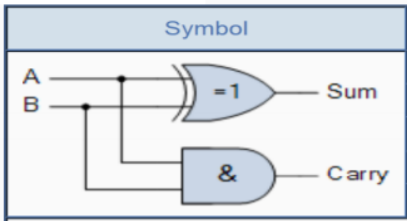
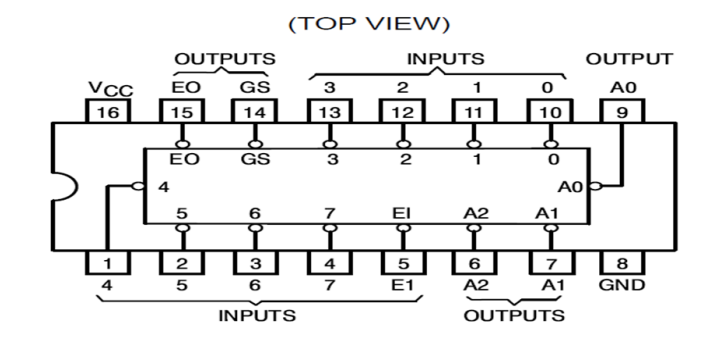

# Electronic Engineering DGTL06027 - 2024 - Summer

## Question 2 [Total Marks 15]

### Question 2.1 (7 Marks)

Produce a truth table to compliment the Half Adder shown in Figure 2.

  
Figure 2: Half Adder

#### Answer 2.1

**Truth Table for Half Adder**  

$Sum = A \oplus B$  
$Carry = A \cdot B$

<details>
<summary>Note about XOR</summary>

The symbol $\oplus$ denotes the XOR (exclusive OR) operation. In the context of electronic engineering and digital logic, $A \oplus B$ typically means the XOR of `A` and `B`. The XOR operation outputs `true` or `1` only when the inputs differ i.e. (one is `true`, the other is `false`).
</details>

| A | B | Sum | Carry |
|---|---|-----|-------|
| 0 | 0 | 0   | 0     |
| 0 | 1 | 1   | 0     |
| 1 | 0 | 1   | 0     |
| 1 | 1 | 0   | 1     |

### Question 2.2 (4 Marks)

Explain the rules that govern Binary Addition, you should account for all possible permutations that may be encountered.

#### Answer 2.2

Binary addition follows the same rules as decimal addition, but with only two digits: `0` and `1`. The rules are as follows:

- 0 + 0 = 0: When both bits are 0, the sum is 0.
- 0 + 1 = 1: When one bit is 0 and the other bit is 1, the sum is 1.
- 1 + 0 = 1: When one bit is 1 and the other bit is 0, the sum is 1.
- 1 + 1 = 10: When both bits are 1, the sum is 0 and a carry of 1 is generated.

When adding three binary digits with a Full Adder, the rules are as follows:

- 0 + 0 + 0 = 0: When both bits are 0 and the `Carry In` is 0, the sum is 0.
- 0 + 0 + 1 = 1: When both bits are 0 and the `Carry In` is 1, the sum is 1.
- 0 + 1 + 0 = 1: When one bit is 0 and the other bit is 1, the sum is 1.
- 0 + 1 + 1 = 10: When both bits are 1, the sum is 0 and a carry out of 1 is generated.
- 1 + 0 + 0 = 1: When one bit is 1 and the other bit is 0, the sum is 1.
- 1 + 0 + 1 = 10: When both bits are 1, the sum is 0 and a `Carry Out` of 1 is generated.
- 1 + 1 + 0 = 10: When both bits are 1, the sum is 0 and a carry out of 1 is generated.
- 1 + 1 + 1 = 11: When both bits are 1 and the `Carry In` is 1, the sum is 1 and a carry out of 1 is generated.

| A | B | Carry In | Sum | Carry Out |
|---|---|----------|-----|-----------|
| 0 | 0 | 0        | 0   | 0         |
| 0 | 0 | 1        | 1   | 0         |
| 0 | 1 | 0        | 1   | 0         |
| 0 | 1 | 1        | 0   | 1         |
| 1 | 0 | 0        | 1   | 0         |
| 1 | 0 | 1        | 0   | 1         |
| 1 | 1 | 0        | 0   | 1         |
| 1 | 1 | 1        | 1   | 1         |

### Question 2.3 (4 Marks)

Demonstrate your ability to do Binary Addition for items a and b below. (Show your answer in tabular form as seen in the example on this answer book.)

#### Question 2.3.1

Add decimal 5 + decimal 3

##### Answer 2.3.1

|        | Decimal |           | Binary |   |   |   |   |
|--------|--------:|-----------|-------:|--:|--:|--:|--:|
|        |       5 |           |        |   | 1 | 0 | 1 |
| +      |       3 |           |        |   | 0 | 1 | 1 |
| Answer |         | Carry Out |        |   |   |   |   |
|        |         | Sum       |        |   |   |   |   |

|        | Decimal |           | Binary |   |   |   |   |
|--------|--------:|-----------|-------:|---|--:|--:|--:|
|        |       5 |           |        | 0 | 1 | 0 | 1 |
| +      |       3 |           |        | 0 | 0 | 1 | 1 |
| Answer |       8 | Carry Out |        | 1 | 1 | 1 | 0 |
|        |         | Sum       |        | 1 | 0 | 0 | 0 |

#### Question 2.3.2

Add decimal 8 + decimal 11

##### Answer 2.3.2

|        | Decimal |           | Binary |   |   |   |   |   |
|--------|--------:|-----------|-------:|---|--:|--:|--:|--:|
|        |       8 |           |        |   | 1 | 0 | 0 | 0 |
| +      |      11 |           |        |   | 1 | 0 | 1 | 1 |
| Answer |         | Carry Out |        |   |   |   |   |   |

|        | Decimal |           | Binary |   |   |   |   |   |
|--------|--------:|-----------|-------:|--:|---|--:|--:|--:|
|        |       8 |           |        |   | 1 | 0 | 0 | 0 |
| +      |      11 |           |        |   | 1 | 0 | 1 | 1 |
| Answer |      19 | Carry Out |        | 1 | 1 | 0 | 0 | 0 |
|        |         | Sum       |        | 1 | 0 | 0 | 1 | 1 |

## Question 3 [Total Marks 15]

### Question 3.1  (4 marks)

**Explain in a short paragraph how a Priority Encoder operates**. You must refer to the difference between inputs with higher and lower priority and how the machine is designed to respond.

#### Answer 3.1

A Priority Encoder is a combinational circuit that encodes multiple binary inputs into a single binary output. The encoder has multiple input lines, and the output is a binary code representing the highest-priority active input. The inputs are prioritized, with the highest-priority input taking precedence over the lower-priority inputs. The encoder scans the inputs from the highest priority to the lowest priority, and the output is generated based on the first active input encountered. The output is a binary code that corresponds to the highest-priority input, and the lower-priority inputs are ignored. This allows the encoder to identify the most significant input and provide a binary representation of that input.

Quick Example for inputs ABC: 

A Priority Encoder is a combinational circuit that encodes multiple binary inputs into a single binary output. The encoder has multiple input lines, and the output is a binary code representing the highest-priority active input. The inputs are prioritized, with the highest-priority input taking precedence over the lower-priority inputs. The encoder scans the inputs from the highest priority to the lowest priority, and the output is generated based on the first active input encountered. The output is a binary code that corresponds to the highest-priority input, and the lower-priority inputs are ignored. This allows the encoder to identify the most significant input and provide a binary representation of that input.

Quick Example for inputs ABC:
To complete the example for a Priority Encoder with inputs ABC, let's assume the following priority order: A > B > C. Here is how the encoder would work for different input combinations:

### Example for inputs ABC to illustrate the operation of a Priority Encoder:

To identify which input has the highest priority, an encoding is needed to represent the active input. There are three inputs: A, B, and C, with the following priority order: A > B > C.. To represent 3 different inputs, a `2-bit` binary code is used. The binary code is generated based on the highest-priority active input. The lower-priority inputs are ignored.

Let A being the highest priority be represented as `00`, B as `01`, and C as `10`.

1. **A = 1, B = 0, C = 0**:
   - Highest priority input A is active.
   - Output: `A = 1` (binary code: `00`)

2. **A = 0, B = 1, C = 0**:
   - Highest priority input B is active.
   - Output: `B = 1` (binary code: `01`)

3. **A = 0, B = 0, C = 1**:
   - Highest priority input C is active.
   - Output: `C = 1` (binary code: `10`)

4. **A = 1, B = 1, C = 0**:
   - Highest priority input A is active (B is ignored).
   - Output: `A = 1` (binary code: `00`)

5. **A = 0, B = 1, C = 1**:
   - Highest priority input B is active (C is ignored).
   - Output: `B = 1` (binary code: `01`)

6. **A = 1, B = 0, C = 1**:
   - Highest priority input A is active (C is ignored).
   - Output: `A = 1` (binary code: `00`)

7. **A = 1, B = 1, C = 1**:
   - Highest priority input A is active (B and C are ignored).
   - Output: `A = 1` (binary code: `00`)

### Summary Table:

| A | B | C | Output (Binary Code) |
|---|---|---|----------------------|
| 1 | 0 | 0 | 00                   |
| 0 | 1 | 0 | 01                   |
| 0 | 0 | 1 | 10                   |
| 1 | 1 | 0 | 00                   |
| 0 | 1 | 1 | 01                   |
| 1 | 0 | 1 | 00                   |
| 1 | 1 | 1 | 00                   |

This table shows how the Priority Encoder processes the inputs and generates the corresponding binary output based on the highest-priority active input.

### Question 3.2 (3 marks)

Produce a block diagram drawing of an 8-to-3-bit Priority Encoder. Ensure you are labelling the drawing by reference to inputs with the highest and lowest priority.

#### Answer 3.2

With 8 Inputs labeled A, B, C, D, E, F, G, H, and 3 Outputs labeled Y0, Y1, Y2.

Let

| Label | Decimal | Binary |
|-------|---------|--------|
| A     | 0       | 000    |
| B     | 1       | 001    |
| C     | 2       | 010    |
| D     | 3       | 011    |
| E     | 4       | 100    |
| F     | 5       | 101    |
| G     | 6       | 110    |
| H     | 7       | 111    |

```plaintext
       +---+---+---+---+---+---+---+---+
       | A | B | C | D | E | F | G | H |
       +---+---+---+---+---+---+---+---+

```


### Question 3.3 (4 marks)

Using the diagram below for reference, state the purpose of the E1 input pin. Explain how you might wire up the input E1 bearing in mind this is an active low device.

  
Figure 3 - Top View of the 8-3 Priority Encoder

#### Answer 3.3

Given the additional information from the datasheet of the 74LS848, an 8-input priority encoder, let's refine the analysis:

##### Purpose of the E1 Input Pin in 74LS848

The E1 pin in the 74LS848 priority encoder is an enable input. Since this device operates with active-low logic, the E1 input must be low (logic 0) for the device to function properly. When E1 is high (logic 1), the device is disabled, and its outputs will be in a high-impedance state.

##### Wiring the E1 Input for the 74LS848

To correctly wire the E1 input pin for enabling or disabling the 74LS848, consider the following:

1. **Enable the Device (E1 = 0):**
   - Connect the E1 pin directly to ground (0V). This will enable the encoder.

2. **Disable the Device (E1 = 1):**
   - Connect the E1 pin to Vcc (e.g., 5V). This will disable the encoder.

3. **Control with Logic Signal:**
   - Connect the E1 pin to a digital output of another device (e.g., a microcontroller or a logic gate). Ensure that the controlling signal can provide the appropriate low and high voltage levels corresponding to the device’s requirements.

##### Example Wiring:  

1. **Direct Enable (Always Enabled):**

   ```plaintext
   E1 (Pin 7) ---- GND (0V)
   ```

2. **Direct Disable (Always Disabled):**

    ```plaintext
    E1 (Pin 7) ---- Vcc (e.g., 5V)
    ```

3. **Controlled by a Microcontroller:**

```plaintext
Microcontroller GPIO ---- E1 (Pin 7)
```

In this setup, the microcontroller can set the GPIO pin low to enable the device or high to disable it.

##### Additional Considerations:  

- **Pull-down Resistor:** If the E1 pin is connected to a controlling signal that might be in a high-impedance state (floating), a pull-down resistor (e.g., 10kΩ) can be used to ensure the E1 pin stays low when the controlling signal is not actively driving it. This ensures the device is enabled by default.

  ```plaintext
  E1 (Pin 7) ---- 10kΩ ---- GND (0V)
  ```

  and connect the controlling signal to E1 as well.

##### Summary

The E1 input pin is an enable pin that must be low (grounded) to enable the 74LS848 priority encoder. Wiring E1 involves connecting it to ground to enable the device, Vcc to disable it, or using a logic control signal to toggle its state as needed.

### Question 3.4 (4 marks)

The Priority Encoder Function table in Figure one, has data missing. In this answer book write in the missing data into the empty spaces for all eight of the digital inputs. Permitted answers may be a 1 or a 0, or a L or a H whichever means that the device is switched on and functioning correctly.

**Priority Encoder Inputs**  

| Row # | EI | 0 | 1 | 2 | 3 | 4 | 5 | 6 | 7 |
|:------|----|--:|--:|--:|--:|--:|--:|--:|--:|
| 01    | H  | X | X | X | X | X | X | X | X |
| 02    | L  | X | H | H | H | H | H | H | H |
| 03    | L  | H | X | X | X | X | X | X |   |
| 04    | L  | X | X | X | X | X | X |   | H |
| 05    | L  | X | X | X | X | X |   | H | H |
| 06    | L  | X | X | X | X |   | H | H | H |
| 07    | L  | X | X | X |   | H | H | H | H |
| 08    | L  | X | X |   | H | H | H | H | H |
| 09    | L  | X |   | H | H | H | H | H | H |
| 10    | L  |   | H | H | H | H | H | H | H |

Figure 4 - Priority Encoder Function Table (Data Missing)

#### Answer 3.4

The Priority Encoder Function table in Figure one, has data missing. In this answer book write in the missing data into the empty spaces for all eight of the digital inputs. Permitted answers may be a 1 or a 0, or a L or a H whichever means that the device is switched on and functioning correctly.

**Priority Encoder Inputs**  

| Row # | EI |   0 |   1 |   2 |   3 |   4 |   5 |   6 |   7 |
|:------|----|----:|----:|----:|----:|----:|----:|----:|----:|
| 01    | H  |   X |   X |   X |   X |   X |   X |   X |   X |
| 02    | L  |   X |   H |   H |   H |   H |   H |   H |   H |
| 03    | L  |   H |   X |   X |   X |   X |   X |   X | `L` |
| 04    | L  |   X |   H |   X |   X |   X |   X | `L` |   H |
| 05    | L  |   X |   X |   H |   X |   X | `L` |   H |   H |
| 06    | L  |   X |   X |   X |   H | `L` |   H |   H |   H |
| 07    | L  |   X |   X |   X | `L` |   H |   H |   H |   H |
| 08    | L  |   X |   X | `L` |   H |   H |   H |   H |   H |
| 09    | L  |   X | `L` |   H |   H |   H |   H |   H |   H |
| 10    | L  | `L` |   H |   H |   H |   H |   H |   H |   H |

You are correct. In a priority encoder, if a higher-order input is active, the lower-order inputs are indeed "don't care" (X). Let's correct the table accordingly:

Corrected Rows 3 and 4
Row # | EI | 0 | 1 | 2 | 3 | 4 | 5 | 6 | 7
--- | --- | --- | --- | --- | --- | --- | --- | --- | ---
03 | L | H | X | X | X | X | X | X | X
04 | L | X | H | X | X | X | X | X | H
Explanation
Row 3
EI (Enable Input): L (Low) - The encoder is enabled.
0: H (High) - Input 0 is active.
1 to 7: X (Don't Care) - These inputs can be either 0 or 1, but they do not affect the output because input 0 has the highest priority.
Row 4
EI (Enable Input): L (Low) - The encoder is enabled.
0: X (Don't Care) - This input can be either 0 or 1, but it does not affect the output because input 1 has a higher priority.
1: H (High) - Input 1 is active.
2 to 6: X (Don't Care) - These inputs can be either 0 or 1, but they do not affect the output because input 1 has the highest priority.
7: H (High) - Input 7 is active, but since input 1 has a higher priority, input 7 is ignored.
Summary
Row 3: Input 0 is active and has the highest priority, so all other inputs are "don't care" (X).
Row 4: Input 1 is active and has the highest priority, so all other inputs are "don't care" (X), even though input 7 is also active.

### Question 3.5 (1 marks)

State in a brief statement what the X means in the context of this device and how it operates. (1 mark)

---
