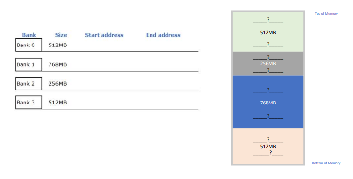

# Memory Maps

A memory map is a diagram of the memory system that shows the address range and the memory modules installed in the system. It's used to illustrate the address range for each memory module and the amount of free space in the system.

## Address Lines

The number of address lines required to address a given amount of memory is given by the formula:

$2^n$ where $n$ is the number of address lines required.

The number of address lines required to address a given amount of memory is calculated by taking the base 2 logarithm of the amount of memory.

For example:

- If we want to address 1 byte of memory, we need 1 address line. This is because $2^1 = 2$, and 2 to the power of 1 equals 2. Thus, we need 1 address line to address 1 byte of memory.
- If we want to address 1 KB of memory (1024 bytes), we need 10 address lines. This is because $2^{10} = 1024$, meaning we need 10 address lines to address 1 KB of memory.

Additional calculations:

- $2^{20} = 1 \text{ MB} = 1024 \text{ KB} = 1,048,576 \text{ bytes}$
- If we want 32 MB of memory, which is $2^5$ times 1 MB, we need 25 address lines (5 for 32 and 20 for a megabyte). This is because 32 MB = $2^5 \times 2^{20} = 2^{25}$, requiring 25 address lines to address 32 MB of memory.

In general:

- $2^{10} = 1 \text{ KB} = 1024 \text{ bytes}$
- $2^{20} = 1 \text{ MB} = 1024 \text{ KB} = 1,048,576 \text{ bytes}$
- $2^{30} = 1 \text{ GB} = 1024 \text{ MB} = 1,073,741,824 \text{ bytes}$
- $2^{40} = 1 \text{ TB} = 1024 \text{ GB} = 1,099,511,627,776 \text{ bytes}$

## Examples

### Example 1

Create a Memory Map for a system with 2GB capacity. Assume the system has 3 x 32MB memory modules residing at the bottom of memory.

Step 1: calculate full address range:

$2\text{ GB} = 2 * \text{GB} =  2^{1}*2^{30} = 2^{31}.$ This means that we need 31 address lines.

$2^{31} = 2,147,483,648_{10} = \text{0x8000\;0000}$

31 / 4 = 7 with a remainder of 3. This means that we need 7 hex digits to represent the address.This means that the address range is 0x0000 0000 to 0x7FFF FFFF.

Step 2: calculate the address range for the 3 x 32MB memory modules. Each module is 32MB = 32 * MB = 2^5 x 2^20 = 2^25. This means that we need 25 address lines to address 32MB of memory.

$$2^{25} = 33,554,432_{10} = 0x200\;0000$$

25 / 4 = 6 with a remainder of 1. This means that we need 6 hex digits to represent the address. This means that the address range is 0x000 0000 to 0x1FF FFFF.

Because we start addressing at `0x000 0000` the first module will be addressed from `0x000 0000` to `0x01FF FFFF`. The second module will be addressed from `0x200 0000` to `0x3FF FFFF`. The third module will be addressed from `0x400 0000` to `0x5FF FFFF`.

Step 3

Step 3: How much free space?
2 GB = 2048 MB
2048 MB – 96 MB = 1952 MB

The memory map for the system is as follows:

0x0,000,000 to 0x1,FFF,FFF: 32MB module 1
0x2,000,000 to 0x3,FFF,FFF: 32MB module 2
0x4,000,000 to 0x5,FFF,FFF: 32MB module 3
0x6,000,000 to 0x7,FFF,FFF: 1,920MB of unused memory

## Example 2

Memory Map for a system with 4GB capacity. Assume the system has 2 x
256MB memory modules residing at the bottom of memory

Step 1: calculate full address range: 4GB = 2^2 x 2^30 = 2^32. This means that we need 32 address lines.
Range of addresses is 0000 0000 to FFFF FFFF

## Example

Memory Map for a system with 8GB capacity. Assume the system has 3 x 160MB memory modules residing at the bottom of memory, calculate the address range for each module and the amount of free space.

Step 1: calculate full address range: 8GB = 8 * GB = 2^3 x 2^30 = 2^33. This means that we need 33 address lines.

$$2^{33} = 8,589,934,592_{10} = 0x2000\;0000$$

33 / 4 = 8 with a remainder of 1. This means that we need 8 hex digits to represent the address. This means that the address range is 0x0000 0000 to 0xFFFF FFFF.** dont trust this**

Step 2: calculate the address range for the 3 x 160MB memory modules. Each module is 160MB = 160 * MB = 2^8 x 2^20 = 2^28. This means that we need 28 address lines to address 160MB of memory.

$$2^{28} = 268,435,456_{10} = 0x1000\;0000$$

28 / 4 = 7 with a remainder of 0. This means that we need 7 hex digits to represent the address. This means that the address range is 0x0000 0000 to 0x0FFF FFFF.

The memory map for the system is as follows:

0x000 0000 to 0x0FFF FFFF: 160MB module 1
0x100 0000 to 0x1FFF FFFF: 160MB module 2
0x200 0000 to 0x2FFF FFFF: 160MB module 3

leaving

0x300 0000 to 0xFFFF FFFF: 7,424MB of unused memory

## question 3

A computer system has a memory with a capacity of 2 GB. The memory is divided into 4 banks, each with a different size.

- Bank 0 has a size of 512 MB
- bank 1 has a size of 768 MB
- bank 2 has a size of 256 MB
- bank 3 has a size of 512 MB

Draw a memory map that shows the location and size of each memory bank.

<table>
    <tr><td bgcolor="lightgreen">Bank 3</td><td>?</td></tr>
    <tr><td bgcolor="lightblue">Bank 2</td><td>?</td></tr>
    <tr><td bgcolor="lightcoral">Bank 1</td><td>?</td></tr>
    <tr><td bgcolor="lightyellow">Bank 0</td><td>?</td></tr>
</table>

| Bank   | Size   | Start Address | End Address |
| ------ | ------ | ------------- | ----------- |
| Bank 3 | 512 MB |               |             |
| Bank 2 | 256 MB |               |             |
| Bank 1 | 768 MB |               |             |
| Bank 0 | 512 MB |               |             |

### Step 1: calculate full address range

$2\text{ GB} = 2 * 1\text{ GB} =  2^{1}*2^{30} = 2^{31}.$ This means that we need 31 address lines.

$2^{31} = 2,147,483,648_{10} = \text{0x8000\;0000}$
stating form 0 we address 0x0000 0000 - 0x7FFF FFFF

31 / 4 = 7 with a remainder of 3. This means that we need 7 hex digits to represent the address.This means that the address range is 0x0000 0000 to 0x7FFF FFFF.

### Step 2 : Calculate `bank 0` address range

$512\text{ MB} = 512 * 1\text{ MB} =  2^9*2^{20} = 2^{29}.$ This means that we need 29 address lines.

$2^{29} = 536,870,912_{10} = 0x2000\;0000$

address bank 0 = 0x0000 0000 - 0x1FFF FFFF

### Step 3 : Calculate `bank 1` address range

$768\text{ MB} = 768 * 1\text{ MB} =  2^9*2^{20} = 2^{29}.$ This means that we need 29 address lines.

$2^{29} = 805,306,368_{10} = 0x3000\;0000$

0x0000 0000 - 0x1FFF FFFF is taken, so add 0x1FFF FFFF to the address range

|     | start       | end         |                          |
| --- | ----------- | ----------- | ------------------------ |
|     | 0x0000 0000 | 0x3000 0000 |                          |
| +   | 0x1FFF FFFF | 0x1FFF FFFF | (last address of bank 0) |
|     | 0x1FFF FFFF | 0x4FFF FFFF |                          |

address bank 1 = 0x2000 0000 - 0x4FFF FFFF

### Step 4 : Calculate `bank 2` address range

$256\text{ MB} = 256 * 1\text{ MB} =  2^8*2^{20} = 2^{28}.$ This means that we need 28 address lines.

$2^{28} = 268,435,456_{10} = 0x1000\;0000$

0x0000 0000 - 0x4FFF FFFF is taken, so add 0x4FFF FFFF to the address range

|     | start       | end         |                          |
| --- | ----------- | ----------- | ------------------------ |
|     | 0x0000 0000 | 0x1000 0000 |                          |
| +   | 0x4FFF FFFF | 0x4FFF FFFF | (last address of bank 1) |
|     | 0x4FFF FFFF | 0x5000 0000 |                          |

address bank 2 = 0x5000 0000 - 0x5FFF FFFF

### Step 5 : Calculate `bank 3` address range

$512\text{ MB} = 512 * 1\text{ MB} =  2^9*2^{20} = 2^{29}.$ This means that we need 29 address lines.

$2^{29} = 536,870,912_{10} = 0x2000\;0000$

0x0000 0000 - 0x5FFF FFFF is taken, so add 0x5FFF FFFF to the address range

|     | start       | end         |                          |
| --- | ----------- | ----------- | ------------------------ |
|     | 0x0000 0000 | 0x2000 0000 |                          |
| +   | 0x5FFF FFFF | 0x5FFF FFFF | (last address of bank 2) |
|     | 0x5FFF FFFF | 0x7FFF FFFF |                          |

address bank 3 = 0x6000 0000 - 0x7FFF FFFF

<table>
    <tr><td bgcolor="lightgreen">Bank 3</td><td>512 MB</td><td>0x6000 0000</td><td>0x7FFF FFFF</td></tr>
    <tr><td bgcolor="lightblue">Bank 2</td><td>256 MB</td><td>0x5000 0000</td><td>0x5FFF FFFF</td></tr>
    <tr><td bgcolor="lightcoral">Bank 1</td><td>768 MB</td><td>0x2000 0000</td><td>0x4FFF FFFF</td></tr>
    <tr><td bgcolor="lightyellow">Bank 0</td><td>512 MB</td><td>0x0000 0000</td><td>0x1FFF FFFF</td></tr>
</table>

| Bank   | Size   | Start Address | End Address |
| ------ | ------ | ------------- | ----------- |
| Bank 3 | 512 MB | 0x6000 0000   | 0x7FFF FFFF |
| Bank 2 | 256 MB | 0x5000 0000   | 0x5FFF FFFF |
| Bank 1 | 768 MB | 0x2000 0000   | 0x4FFF FFFF |
| Bank 0 | 512 MB | 0x0000 0000   | 0x1FFF FFFF |
