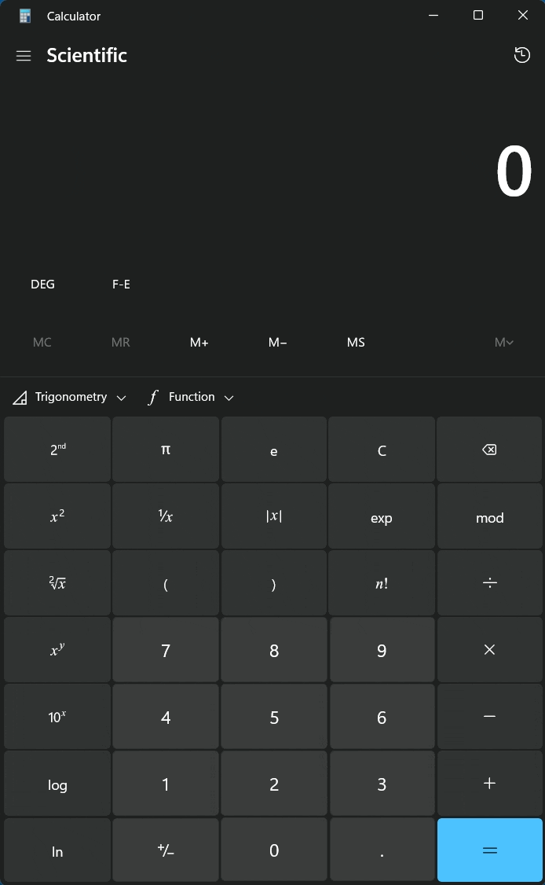

# Windows Calculator

## Get $\log_2{x}$

> The $\ln$ function is used to take the natural logarithm of a number. To get the logarithm of a number to a different base, you can use the following formula:
> $\log_b{x} = \frac{\ln{x}}{\ln{b}}$.

To get the logarithm of a number e.g. `8` to the base `2` , you can use the following steps:

1. Open the Windows Calculator.
2. Select the "Scientific" mode from the menu.
3. Enter the number you want to take the logarithm of i.e. `8`
4. Press the $\ln$ button.
5. Press the $\div$ button.
6. Enter the number `2`.
7. Press the $\ln$ button.
8. Press the `=` button.

The result should be `3` .

> Screen GIF showing the steps to get $\log_2{8}$ using the Windows Calculator.

---
Copyright &copy; 2024 Mark Crowe <https://github.com/marcocrowe>. All rights reserved.
